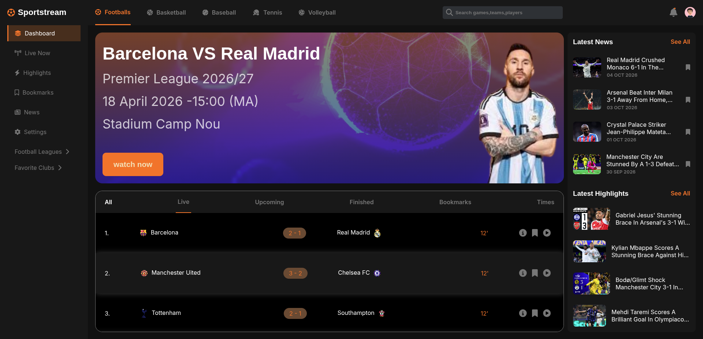

# Sports Live Dashboard ⚽📊

A clean, modern, and fully responsive **football (soccer) live dashboard** built with **pure HTML and CSS only** — no frameworks, no JavaScript libraries.

Perfect lightweight starting point for a sports tracker.  
Currently using **static/mock data** (season 2026/27 demo).

**Live Demo:** https://ayoubiayoubi.github.io/dashboard-sports-live/

  

## ✨ Current Features

- Beautiful **featured match card** (Barcelona vs Real Madrid – Premier League 2026/27)
- **Live scores** section with mock ongoing matches (all shown at 12' for demo)
- Navigation tabs: **all** | **live** | **upcoming** | **finished** | **bookmarks** | **times**
- **Latest News** section with sample headlines and dates (e.g., Real Madrid 6-1 Monaco on 04 OCT 2026)
- **Latest Highlights** section with key moments summaries (e.g., Mbappé brace, Jesus brace)
- Fully responsive design — looks great on mobile, tablet, and desktop
- Clean layout using CSS Flexbox/Grid
- Icons powered by **Font Awesome** (for tabs, times, bookmarks, arrows, football, etc.)

## 🛠️ Technologies Used

- **HTML5**
- **CSS3** (Flexbox + Media Queries for responsiveness)
- **Font Awesome 6** (free icons via CDN – added in `<head>` for better visual elements like clock for time, star for bookmarks, arrow for "see all", football icon, etc.)
- **No JavaScript** (yet) – everything is static and hardcoded
- **No frameworks** (pure vanilla HTML/CSS)
- Hosted on **GitHub Pages**

→ Intentionally kept **very simple and lightweight** to make it easy to understand and extend.
